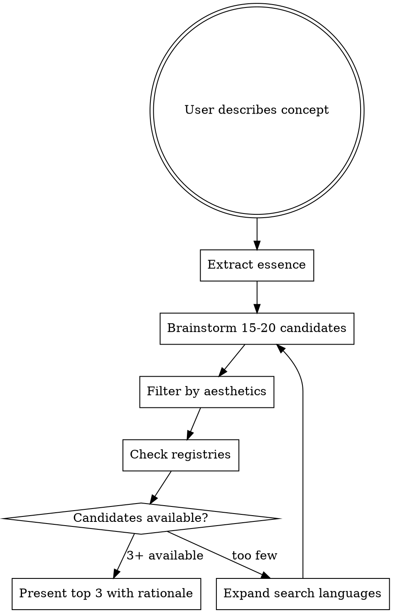

# Naming Developer Tools

短く、意味が深く、打ちやすい名前を見つけるプロセス。

## Overview

良い名前 = **短い実在の単語 + 意味の深み + レジストリ空き**。antfu の `taze`（トルコ語で「新鮮」）のように、マイナーだが実在する単語が理想。略語や造語より、知られていない言語の短い単語のほうが記憶に残る。

## Process



### 1. Extract Essence

ユーザーに確認（既出ならスキップ）：
- **意味**: 何を表現したいか（動詞？名詞？メタファー？）
- **トーン**: 硬い（`rust`）vs 柔らかい（`bun`）
- **文字数**: 好みがあれば（デフォルト: 3-6文字）

### 2. Brainstorm Candidates

以下のカテゴリで **15-20候補** を並列生成。**他言語を最優先で探す**：

| 優先度 | カテゴリ | 例 | 狙い |
|:---:|---------|-----|------|
| ★ | **他言語（独/仏/蘭/北欧/トルコ語）** | taze (トルコ: 新鮮), berm (英古: 棚), tritt (独: 踏み段) | **最も空きが多く、意味の深みがある** |
| ★ | **メタファー（自然/登山/建築/航海）** | cairn, cleat, ledge | イメージ喚起 |
| | 英語の同義語・類語 | grip, perch, nook | 直球だが空きが少ない |
| | 音の響き重視 | 子音+母音のリズムが良いもの | 打ちやすさ |

**なぜ他言語が最優先か**: 英語の3-5文字名詞は npm でほぼ全滅。ドイツ語・トルコ語・オランダ語・北欧語は4-5文字の実在名詞が豊富で空いていることが多い。`taze`（antfu）、`vite`（仏: 速い）はこの戦略の成功例。

**候補の半数以上は他言語 or メタファーから出すこと。** 英語だけ・略語だけに偏らない。

### 3. Filter by Aesthetics

基準（優先順）：
1. **3-6文字** — タイプしやすい、覚えやすい
2. **子音+母音のリズム** — `berm`, `taze`, `vite` のような打感
3. **既存の有名ツール名と非類似** — 混同を避ける
4. **意味の深み** — 語源を辿ると「なるほど」がある
5. **グローバルに発音可能** — 言語を問わず読める

### 4. Check Registries

対象レジストリに応じてコマンドを実行：

```bash
# npm
npm view <name> version 2>/dev/null || echo "AVAILABLE"

# PyPI
pip index versions <name> 2>/dev/null || echo "AVAILABLE"

# crates.io
cargo search <name> --limit 1
```

一括確認で効率化：
```bash
for pkg in candidate1 candidate2 candidate3; do
  echo -n "$pkg: "
  npm view "$pkg" version 2>/dev/null || echo "AVAILABLE"
done
```

### 5. Present Top 3

各候補について：
- **名前**（文字数）
- **語源・意味** — どの言語で何を意味するか
- **なぜ合うか** — コンセプトとの繋がり（ストーリー）
- **レジストリ状況**

**推しを1つ選び、理由を述べる。** 「npm空いてます」だけでなく「この名前がこのツールに合う理由」を語る。

## Quick Reference

| 良い名前の特徴 | 悪い名前の特徴 |
|---------------|---------------|
| 実在の単語 | 無理な略語 (fthld) |
| 3-6文字 | 8文字以上 |
| 語源に意味がある | 意味不明な造語 |
| 発音できる | 子音だけ (brmgn) |
| レジストリ空き | 0.0.1 で占有済み |

## Common Mistakes

- **英語だけで探す** → 短い英単語は枯渇している。**他言語を最優先で探す**
- **略語に走る** → `cmsg` や `fthld` は覚えにくい。実在する短い単語（`berm`, `taze`）のほうが100倍良い。**略語は候補に入れない**
- **`git` prefix を付ける** → `gitfoo` は7文字以上になりがち。ツール名自体を短くし、git 連携はサブコマンドや説明文で伝える
- **意味を無視して音だけで選ぶ** → 語源のストーリーが名前に深みを与える
- **1候補だけ提示** → 常に3候補。選択肢があると判断しやすい
- **レジストリ確認を後回し** → 先に確認して絞り込む
